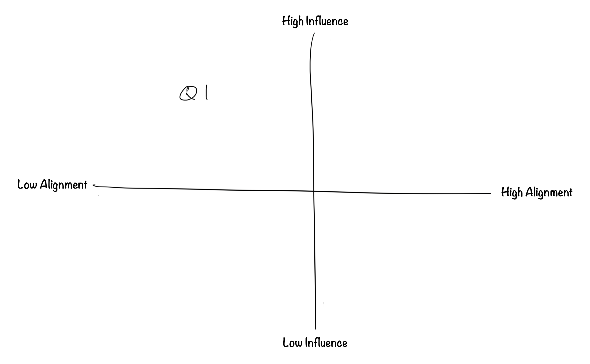

## ***Exercise 2.1 Build a Stakeholder Map for Your Organization***

Assume your organization has decided to build an internal engineering platform. Perhaps you are already building one. As you think about the current challenges, there are probably many areas where product thinking would face or is facing challenges from the interaction of various stakeholders within your company.

Create a stakeholder map and populate the map with several relevant stakeholders. Pick one stakeholder from Quadrant 1 and create a list of their objections or constraints.

Describe how the capability owned by the stakeholder could either be

* provided as an API that provides the platform engineers with a self-serve experience or  
* defined by a standard that would enable the platform engineers to solve for the desired product experience while meeting the needs of the stakeholders.

### **Solution**

Example Stakeholder map and alignment issues:

Role: Director \- Office of Program Management

Level of Influence: High. OPM defines organization approval processes.

Alignment: Low

Issue: Every deployment requires a very time-consuming human checklist and review approval process. The PMO states the objectives as broad internal visibility into changes and assurance of PO approval. The information required originates in Jira and with Product Owners.

Possible alternatives: Create automation to merge the info from Jira into the Change Calendar (visibility tooling) and create admission controllers that confirm commit SHA with PO approval in Jira. This would be a rapid and automated method to perform the same tasks currently performed in the approval meeting.
