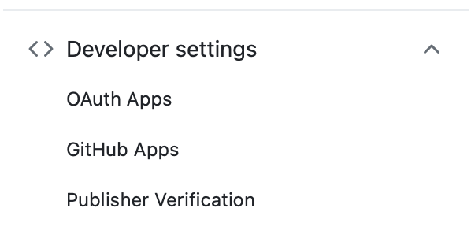
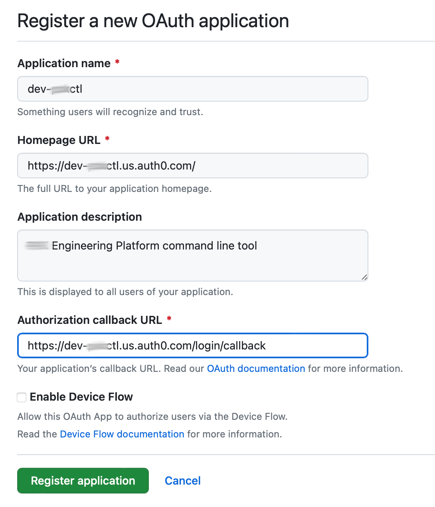
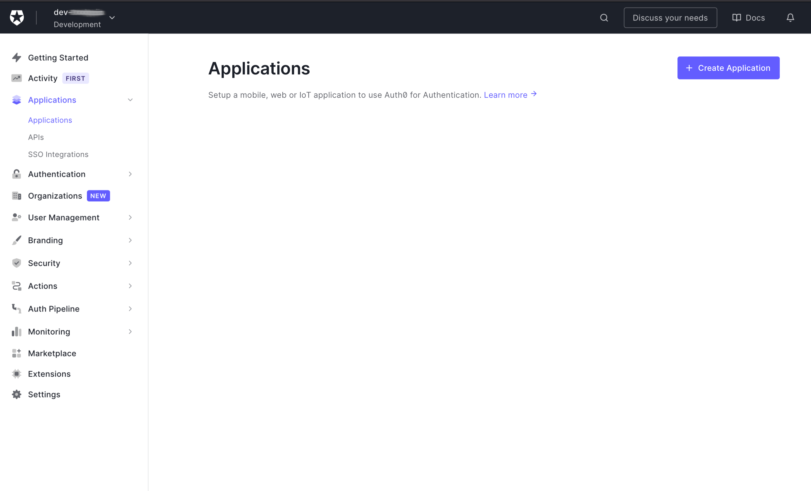
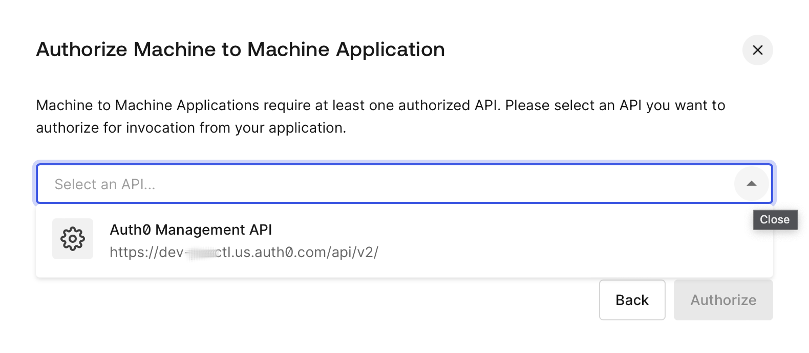
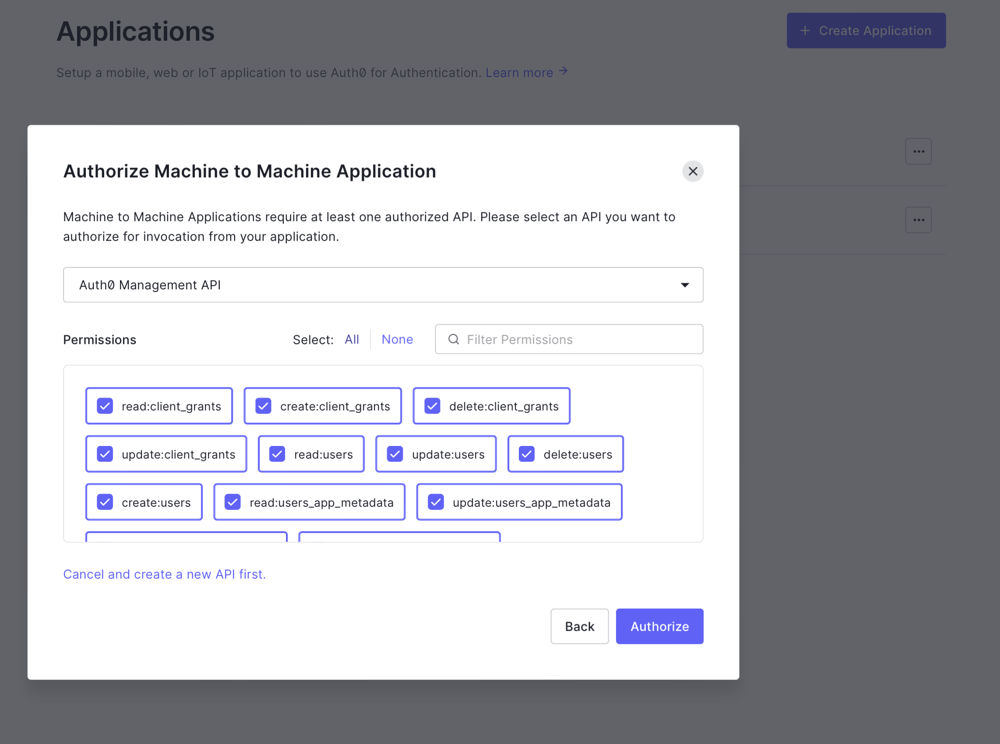
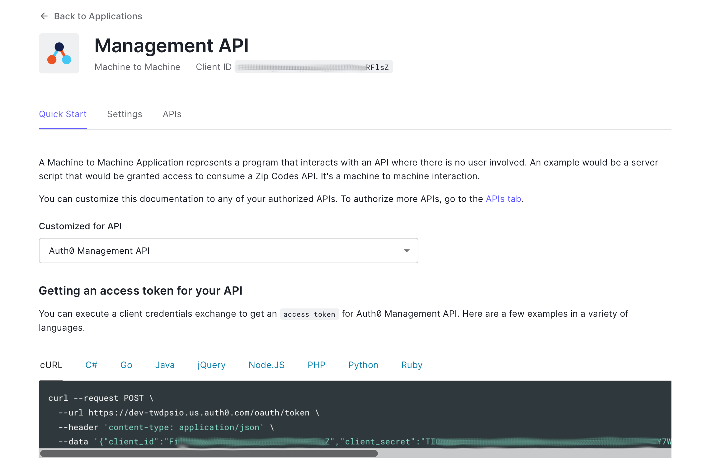

# Example Solution for Project 7.1: Configure SaaS Identity Provider for Device Auth Flow  

## First step is to bootstrap the app definitions in GitHub and Auth0  

###  Create Oauth App in GitHub Organization

To start, create both dev and production oauth-apps in your github organization that Auth0 can use to access user information. This exercise solution document will refer to the oauth-apps as dev-epectl and epectl. Naturally, you will have to choose your own unique name. Use your auth0 app name wherever you see the epetech example. Note, in this context dev or prod do not directly refer to development or production environments within the engineering platform. The Dev instances of the auth0 configuration is used only for testing the automated configuration of the auth0 tenant. As part of validating the configuration, the initial platform product teams development role cluster(s) (in our case, sbx) is configured to use the dev-epectl tenant. But all other clusters will use the prod auth0 tenant whether they are used for production workloads, non-production, or even non-customer facing. In both cases, these are part of the same github organization.  

1. In the GitHub **Organization** settings, open `Oauth Apps` under `Developer Settings`



2. Click the `New Org OAuth App` button in the upper right.  

3. Enter the necessary info the for the dev-epectl auth0 tenant **dev-epectl.us.auth0.com**

> Note: You do not need to check Enable Device Flow here as this will be managed by Auth0



On the screen that follows, create a new `Client Secret`. Save both the Client ID and the Client Secret in your secrets store.  

1. Repeat for **epectl.us.auth0.com**  


### Bootstrap Management API client in Auth0

1. Create an account on auth0.com, using github authentication - free tier is all that is needed

2. Create two tenants (again, use your chosen name):

* dev-epectl
* epectl

1. Swtich to the dev-epectl tenant. Go to the applications dashboard and click `Create Application`.  

  

Set the name for the new application to `Management API` and choose Machine-to-Machine-Application and the app type.  

  

On the screen that follows, select the 'Auth0 Managment API' option from the popup.  

  

Next, Under Permissions click `Select: All` and click `Authorize`  

  

From the example window, copy the client_id and client_secret and store these in your secrets store.

  

2. Repeat for `epectl`

_The related auth.com documentation_:  
- [machine-to-machine apps](https://auth0.com/docs/get-started/auth0-overview/create-applications/machine-to-machine-apps)
- [Managegment API Tokens](https://auth0.com/docs/secure/tokens/access-tokens/get-management-api-access-tokens-for-production)

## Next step: Connect Auth0 Application to GitHub social authentication  

Once you have the Management API ID and Secret, the rest of the configuration can be managed through a pipeline. A working example is included in this companion code. The automated configuration of the auth0 app includes oauth2 for web to support reverse proxy security for web apps.  

But, you can also make these configurations through the Auth0 API, which is a good experience and appropriate for a learning setting.  

From the Dashboard, select Authentication => Social and click Create Connection.  

Choose GitHub. Enter the Client ID and Secret. Select the email address attribute and the read:user, read:org, and read:public_key permissions. And turn off syncing the user profile. We don't actually want to retain any information about the user per se.  

Go back to our application (dev-epectl) and turn on GitHub under the Connections tab.  

## Final step: Create Action to fetch successfully authenticated user's Team membership from GitHub and add to result JWT  

Review the coe-based solution in the companion code.  

To setup via the UI, go to the Actions option screen from the Dashboard and under the custom tab click Create Action. Paste the example javascript from below, of coures, modifying for your actual tenant name.  

Now, from the Actions submenu, go to the Trigger screen and select post-login. Here you can drag-and-drop the custom action from the custom library into the sppt right after the Start. This means that once a user has successfully authenticated via their GitHub identity, then the custom script will use their token to fetch their teeam membership from the epetech (your org) github org and include this information among the claims in the returned JWT.

Custom actions can be created using javasccript. This example demonstrates the basic requirements.  
```js
/**
* Handler that will be called during the execution of a PostLogin flow.
*
* @param {Event} event - Details about the user and the context in which they are logging in.
* @param {PostLoginAPI} api - Interface whose methods can be used to change the behavior of the login.
*/
exports.onExecutePostLogin = async (event, api) => {
  const requiredOrganization = 'epetech';

  // get users social_connection access token. Only possible with successful authentication.
  const { ManagementClient } = require('auth0');
  const management = new ManagementClient({
    domain: 'dev-epectl.us.auth0.com', // our tenant is a subdomain of us.auth0.com for the free tier, that's why it had to be unique.
    clientId: event.secrets.MANAGEMENT_API_CLIENT_ID,
    clientSecret: event.secrets.MANAGEMENT_API_CLIENT_SECRET,
    scope: 'read:users'
  });
  const social_metadata = await management.getUser({ id: event.user.user_id });
  var github = social_metadata.identities.filter(function (id){
                 return id.provider === 'github';
               })[0];
  var access_token = github.access_token;

  // fetch the user's GitHub team memberships
  const axios = require("axios");
  const githubAPIUrl = 'https://api.github.com/user/teams';
  const options = {
    headers: {
      'Authorization': `token ${access_token}`,
      'User-Agent': 'dev-epectl' // the auth0 tenant name
    }
  };

  try {
    var response = await axios.get(githubAPIUrl, options);

    var github_teams = response.data.map(function(team) {
      return team.organization.login + "/" + team.slug;
    });

    // Check if the user is part of the required organization
    const isInOrganization = response.data.some(team => team.organization.login === requiredOrganization);

    if (!isInOrganization) {
      return api.access.deny(`User is not a member of the required GitHub organization: ${requiredOrganization}`);
    }

    // add teams list as claims to jwt
    if (event.authorization) {
      api.idToken.setCustomClaim("https://github.org/epetech/teams", github_teams);
      api.idToken.setCustomClaim("cli", "dev-epectl");  // the auth0 tenant name
    }

  } catch (error) {
    // add the error message to the custom claims
    console.error('Error fetching GitHub team memberships:', error.message);
    if (event.authorization) {
      api.idToken.setCustomClaim("github_teams_error", error.message);
    }
  }

};
```

## Human testing of the configuration  

This is a human-centered auth workflow so for purposes of this exercise, it makes more sense to also do a manual confirmation of the configuration.  

To QA either tenant:  

1. request device authorization code.  

```bash
curl --request POST \
  --url 'https://dev-epectl.us.auth0.com/oauth/device/code' \
  --header 'content-type: application/x-www-form-urlencoded' \
  --data 'client_id=******567g35' \
  --data 'scope=openid offline_access' \
  --data 'audience=https://dev-epectl.us.auth0.com/api/v2/'
```

2. Note the device_code and verification_uri_complete in the response.  

3. Use the verification_uri_complete link in  your browser to complete the device and user authentication. Will appear similar to:  
```
https://dev-epectl.us.auth0.com/activate?user_code=XXXX-XXXX
```

4. Using the device_code, request an oidc token.
```
curl --request POST \
  --url 'https://dev-epectl.us.auth0.com/oauth/token' \
  --header 'content-type: application/x-www-form-urlencoded' \
  --data grant_type=urn:ietf:params:oauth:grant-type:device_code \
  --data 'device_code=*****mnLg' \
  --data 'client_id=******567g35'
```
The token received will contain the following info:
```
{
    "access_token": "*****O8EDn9A",
    "refresh_token": "*****j8bYK",
    "id_token": "*****lhwgf==",
    "scope": "openid offline_access",
    "expires_in": 86400,
    "token_type": "Bearer"
}
```

5. Go to jwt.io and place the contents of the id_token into the `Encoded` box.  
The display should show the Signature as verfied and the contents of the id token will include info similar to the following:  
```
{
  "https://github.org/epetech/teams": [
    "epetech/platform"
  ],
  "cli": "dev-epectl",
  "iss": "https://dev-epectl.us.auth0.com/",
  ...
}
```
The list of teams will be all those teams in which you are a member in the epetech github org.
